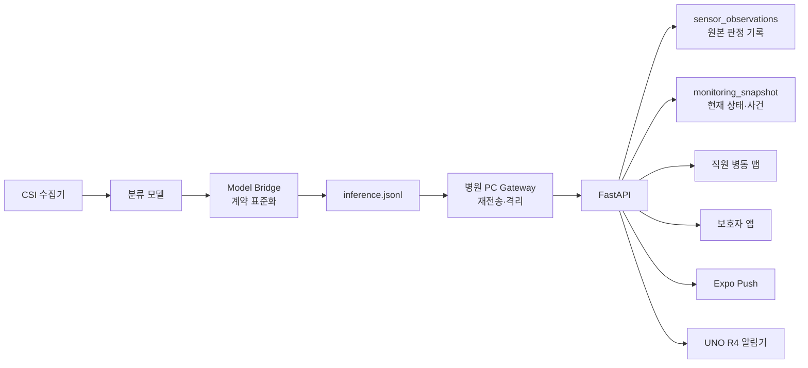

# Care Signal 통합 시스템 설계서

## 1. 목적과 완료 범위

Care Signal은 WiFi CSI 기반 분류 모델이 병실 상태를 판정하고, 병동 직원·보호자·현장 알림 장치에 필요한 최소 정보를 전달하는 비영상 안전 모니터링 시스템이다.

이 설계의 완료 범위는 다음과 같다.

- 실제 모델을 교체 가능한 표준 관측 계약으로 연결한다.
- 네트워크 장애와 중복 재전송에도 관측 데이터를 잃거나 중복 처리하지 않는다.
- 모델 판정 원본 메타데이터, 병실 최신 상태와 상태 이력, 사건 대응 기록을 분리해 저장한다.
- 병동 배치도에서 병실 위험 상태와 장치 데이터 최신성을 확인한다.
- 직원과 보호자에게 서로 다른 정보와 권한을 제공한다.
- 시뮬레이터와 실제 모델이 같은 서버 경로를 사용한다.

환자의 진단이나 의료적 판단은 범위에 포함하지 않는다. 모델 출력은 `이상 징후 의심`이며 직원의 현장 확인을 대체하지 않는다.

## 2. 시스템 경계와 가정

### 포함

- CSI 수집·분류 프로그램과의 파일/표준입력 기반 연결
- 병원 PC 게이트웨이
- FastAPI 서버와 PostgreSQL
- 직원용 병동 맵 웹
- 보호자용 웹/Expo 앱과 푸시 알림
- UNO R4 경보 조회 API

### 외부 구성요소

- CSI 송수신 하드웨어와 드라이버
- 학습 파이프라인과 모델 파일
- Expo Push Service
- Render 배포 플랫폼과 Neon PostgreSQL

### 현재 가정

- 모델은 한 번의 추론마다 상태와 신뢰도를 낸다.
- 모델이 실제로 연결되기 전에는 model bridge와 simulator가 같은 계약을 생성한다.
- 원본 CSI 행렬은 별도 연구 데이터 저장소에 보관하고 운영 DB에는 넣지 않는다.
- 운영 DB에는 판정 결과와 재현에 필요한 추적 메타데이터만 저장한다.

## 3. 전체 구성



## 4. 모델 출력 계약

모델과 서버 사이의 표준 JSON은 다음과 같다.

```json
{
  "observation_id": "obs-room01-20260809-000042",
  "room_id": "room-01",
  "device_id": "csi-gateway-a-01",
  "state": "OUT_OF_BED",
  "confidence": 0.91,
  "captured_at": "2026-08-09T09:12:33.420Z",
  "model_version": "care-csi-1.0.0",
  "sequence_no": 42
}
```

### 필드 규칙

| 필드 | 규칙 | 목적 |
|---|---|---|
| `observation_id` | 장치 또는 게이트웨이에서 생성한 고유 문자열 | 재전송 멱등성 |
| `room_id` | 병동 배치에 등록된 값 | 잘못된 병실 데이터 차단 |
| `device_id` | 게이트웨이/수집기 식별자 | 장치 상태와 장애 추적 |
| `state` | 아래 네 상태 중 하나 | 상태 엔진 입력 |
| `confidence` | 유한한 0~1 실수 | 판정 품질 표시 |
| `captured_at` | 시간대가 포함된 ISO 8601 | 수집 지연 계산 |
| `model_version` | 배포 모델 버전 | 결과 재현·비교 |
| `sequence_no` | 장치별 증가 정수, 선택 | 누락·순서 역전 탐지 |

### 상태 사전

| 표준 상태 | 의미 | 위험 등급 |
|---|---|---|
| `EMPTY` | 침대 영역에서 대상 미감지 | NORMAL |
| `IN_BED` | 침대 영역에서 안정 상태 | NORMAL |
| `OUT_OF_BED` | 침대 영역 이탈 | WARNING |
| `MOVEMENT_ANOMALY` | 낙상 가능성을 포함한 이상 움직임 | CRITICAL |

모델의 `FALL`, `FALL_DETECTED`, `ANOMALY` 같은 별칭은 model bridge에서 `MOVEMENT_ANOMALY`로 변환한다. 서버는 표준 상태만 받는다.

## 5. 처리 흐름

### 정상 처리

1. 모델이 표준 관측을 JSONL에 기록한다.
2. 게이트웨이가 문법·필수 필드·상태·신뢰도를 검사한다.
3. 서버가 장치 키를 검증한다.
4. `observation_id`를 PostgreSQL에 삽입한다.
5. 같은 ID가 처음일 때만 병실 상태와 이력을 갱신한다.
6. 위험 상태로 전환된 경우 같은 병실·유형의 활성 사건이 없을 때 사건을 생성한다.
7. 병동 맵, 보호자 알림과 UNO R4 조회 결과가 갱신된다.

### 재전송과 중복

1. 업로드 실패 데이터는 `pending_uploads.jsonl`에 표준 계약 그대로 보관한다.
2. 연결 복구 시 오래된 항목부터 다시 전송한다.
3. 서버의 `sensor_observations.observation_id` 고유키가 중복 삽입을 막는다.
4. 중복 요청은 성공으로 응답하되 `duplicate: true`를 반환한다.
5. 중복 요청은 상태 이력과 사건을 다시 만들지 않는다.

### 잘못된 모델 출력

- 파싱 실패, 미등록 상태, 범위 밖 신뢰도는 업로드 큐를 막지 않는다.
- 해당 줄은 dead-letter 파일로 이동하고 다음 관측을 처리한다.
- 장치 키, DB URL과 원본 민감 데이터는 로그에 기록하지 않는다.

## 6. 데이터 설계

### `sensor_observations`

모든 유효한 모델 판정을 append-only로 보관한다.

| 열 | 형식 | 제약 |
|---|---|---|
| `observation_id` | TEXT | PRIMARY KEY |
| `room_id` | TEXT | NOT NULL |
| `device_id` | TEXT | NOT NULL |
| `state` | TEXT | 표준 상태 CHECK |
| `confidence` | DOUBLE PRECISION | 0~1 CHECK |
| `captured_at` | TIMESTAMPTZ | NOT NULL |
| `received_at` | TIMESTAMPTZ | 서버 기록 |
| `model_version` | TEXT | NOT NULL |
| `sequence_no` | BIGINT | NULL 가능 |
조회 인덱스는 `(room_id, captured_at DESC)`, `(device_id, received_at DESC)`를 둔다.

### `monitoring_snapshot`

빠른 화면 표시와 사건 처리를 위한 현재 상태다.

- 병실별 최신 상태
- 병실별 최근 상태 이력(최대 500건)
- 사건과 대응 상태(최대 2,000건)
- 구형 스냅샷에는 없는 필드를 기본값으로 보완한다.

### `push_subscriptions`

보호자 앱의 Expo Push Token과 연결 대상만 저장한다. 판정 신뢰도와 임상 세부정보는 푸시 메시지에 포함하지 않는다.

### 로그인 세션

배포 DB에는 보호자·직원 세션의 원문 토큰 대신 SHA-256 해시와 만료시각만 저장한다. 보호자 세션은 기본 30일, 직원 세션은 기본 12시간 유지되며 로그아웃 시 즉시 삭제한다. 따라서 Render 재시작으로 세션이 사라지지 않으면서 DB 유출 시 원문 bearer token이 직접 노출되지 않는다.

### 트랜잭션 경계

새 관측 삽입과 `monitoring_snapshot` 갱신은 한 PostgreSQL 트랜잭션에서 수행한다. 스냅샷 행은 `SELECT ... FOR UPDATE`로 직렬화해 여러 서버 인스턴스가 동시에 갱신해도 상태가 사라지지 않게 한다.

## 7. API 계약

### 장치 입력

- `POST /api/v1/inference`
- 인증: `X-Device-Key`
- 응답: 기존 병실 상태 필드 + `observation_id`, `duplicate`

### 직원 조회

- `GET /api/v1/ward/map`
- `GET /api/v1/rooms/{room_id}/status`
- `GET /api/v1/rooms/{room_id}/history?limit=30`
- `GET /api/v1/observations?room_id=&device_id=&limit=100`
- `GET /api/v1/devices/status`
- `GET /api/v1/events`
- `PATCH /api/v1/events/{event_id}`

병동 맵, 원본 관측과 사건 조회는 직원 인증이 필요하다. 공개 상태 조회를 유지할 경우 환자 식별정보를 포함하지 않는다.

### 보호자

- `POST /api/v1/guardian/login`
- `GET /api/v1/guardian/patient`
- `GET /api/v1/guardian/events`
- `POST /api/v1/guardian/push-token`

보호자 API는 병실 위험 등급, 신뢰도, 모델 버전 같은 내부 판정 정보를 숨기고 확인 진행 상태만 제공한다.

### 현장 알림기

- `GET /api/v1/devices/{device_id}/alert?room_id=room-01&location=room`
- 인증: `X-Device-Key`

직원이 사건을 확인하면 경보음이 중지된다. 장치 인증과 heartbeat는 운영 전 추가 보안 범위다.

## 8. 사건 규칙

| 조건 | 결과 |
|---|---|
| `OUT_OF_BED`로 상태 전환 | WARNING 사건 생성 |
| `MOVEMENT_ANOMALY`로 상태 전환 | CRITICAL 사건 생성 |
| 같은 병실·유형의 활성 사건 존재 | 중복 사건 생성하지 않음 |
| `ACKNOWLEDGED` | 확인 시각 저장, 장치 소리 중지 |
| `RESPONDING` | 직원 이동 중 상태 표시 |
| `COMPLETED` | 완료 시각 저장 |
| `FALSE_ALARM` | 오탐으로 종료 |

모델 프레임 한 번만으로 긴급 사건을 만드는 현재 규칙은 시연용이다. 실제 정확도 측정 후 `N회 연속`, `최소 지속시간`, 상태별 confidence 임계값을 설정한다.

## 9. 장치 상태와 데이터 품질

`GET /api/v1/devices/status`는 장치별 다음 값을 제공한다.

- 마지막 수집 시각과 서버 수신 시각
- 수집→수신 지연
- 마지막 sequence 번호
- 모델 버전
- 최근 상태와 병실
- `online`, `stale` 판정

기본 운영 기준은 마지막 수신 후 30초 이내 `online`, 그 이상은 `stale`이다. 센서 단절은 환자 위험과 다른 색상·문구로 표시한다.

## 10. 보안·개인정보

- DB URL, 장치 키, 직원 코드와 연결 코드는 환경변수로만 주입한다.
- `.env`와 실제 키는 Git에 커밋하지 않는다.
- 장치 입력에는 장치 키, 직원·보호자 API에는 세션 토큰을 사용한다.
- 보호자 응답과 푸시에는 환자 식별정보와 모델 신뢰도를 최소화한다.
- 원본 CSI에는 재식별 가능성이 있을 수 있으므로 연구 저장소 접근을 분리한다.
- 운영 전에는 공용 코드 로그인 대신 사용자·역할·만료 세션 테이블로 교체한다.
- HTTPS, 요청 크기 제한, 속도 제한, 감사 로그와 키 교체 절차가 필요하다.

## 11. 장애 대응

| 장애 | 대응 |
|---|---|
| 인터넷 단절 | 게이트웨이 spool 후 순차 재전송 |
| 잘못된 모델 행 | dead-letter 격리 후 다음 행 진행 |
| 동일 관측 재전송 | 관측 ID 고유키로 한 번만 처리 |
| 서버 재시작 | PostgreSQL 스냅샷 복원 |
| 다중 서버 동시 갱신 | 행 잠금 트랜잭션 |
| 푸시 실패 | 사건 처리는 계속하고 푸시만 실패 허용 |
| 센서 무응답 | 병동 맵에 장치 단절 표시 |
| Neon 불가 | 자동으로 구형 DB로 되돌리지 않고 장애를 명확히 표시 |

## 12. 검증 전략

### 단위 테스트

- 상태→위험 등급 매핑
- 사건 중복 방지와 상태 전환
- 오래된 스냅샷 호환
- 관측 ID 중복 처리
- gateway 표준화·dead-letter·spool

### API 통합 테스트

- 직원·보호자·장치 인증 경계
- 미등록 병실과 잘못된 payload 거부
- 여러 병실 이력 격리
- 관측 조회 필터와 장치 상태
- 중복 재전송 시 관측·이력·사건이 하나인지 확인

### 장애 테스트

- 서버 중단 중 100건 생성 후 복구 전송
- 중복 파일 재처리
- 잘린 JSONL 행
- 순번 누락과 역전
- PostgreSQL 동시 갱신

### 시연 합격 시나리오

1. 103호 장치가 온라인으로 표시된다.
2. `IN_BED` 관측이 기록되고 맵이 정상으로 표시된다.
3. `OUT_OF_BED` 관측으로 주의 사건이 생성된다.
4. 직원이 확인하면 UNO 경보가 중지된다.
5. `MOVEMENT_ANOMALY` 관측으로 위험 표시와 보호자 진행 알림이 생성된다.
6. 직원이 처리 완료하고 사건 시각이 남는다.
7. 같은 관측을 재전송해도 기록과 사건 수가 늘지 않는다.
8. 서버 재시작 후 상태, 관측과 사건이 복원된다.
9. 장치 입력을 중단하면 환자 위험과 구분된 센서 단절 경고가 표시된다.

## 13. 배포 구조

- GitHub `main`을 Render 웹 서비스가 자동 배포한다.
- Dockerfile이 FastAPI/Uvicorn을 실행한다.
- `NEON_DATABASE_URL`을 우선 사용하고 `/health`는 `neon-postgres`를 보고한다.
- 구형 Render DB는 초기 Neon 데이터가 비어 있을 때만 한 번 복사한다.
- 환경변수 변경, push와 실제 배포는 로컬 검증·사용자 승인 후 수행한다.

## 14. 완료 판정

소프트웨어 통합 완료는 다음 조건을 모두 만족할 때다.

- 모델 또는 model bridge가 표준 관측을 연속 생성한다.
- 장애 후 재전송과 중복 방지가 자동 테스트로 증명된다.
- 관측, 상태, 사건이 PostgreSQL에 남는다.
- 병동 맵에서 상태와 장치 단절을 구분한다.
- 보호자에게 최소화된 진행 정보가 전달된다.
- 전체 테스트가 통과하고 공개 배포에서 같은 흐름이 재현된다.

졸업작품 최종 완료에는 실제 CSI 장비 실험의 정확도, 오탐률, 탐지 지연과 네트워크 복구 시간을 측정해 보고서에 포함해야 한다.
